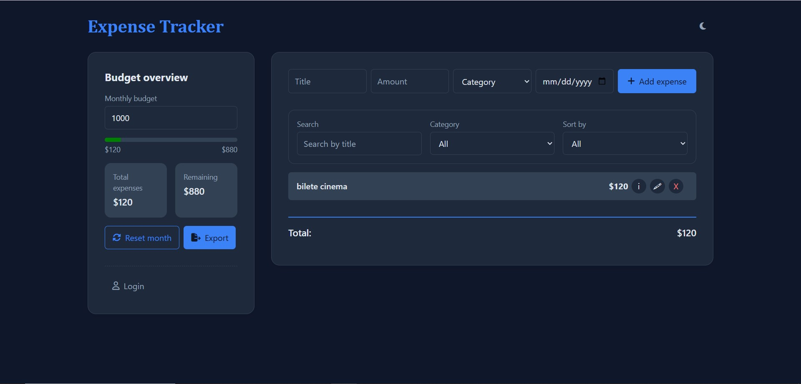
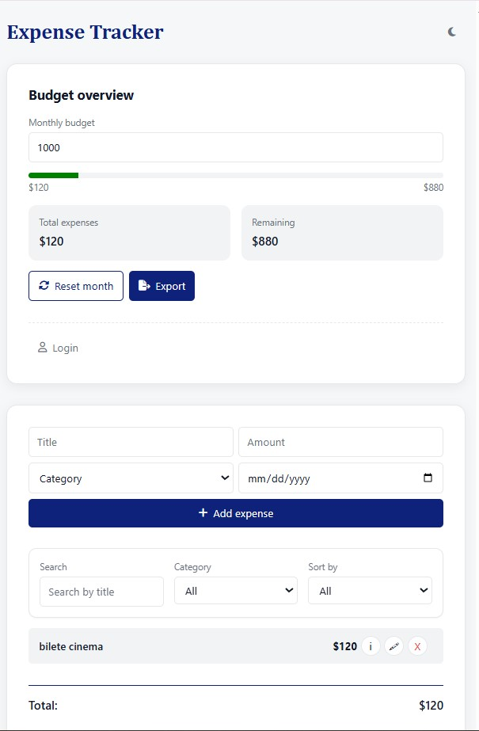

# 💸 Expense Tracker App

A simple, responsive web application that allows users to track and manage their daily expenses.  
Built using **HTML**, **CSS** and **vanilla JavaScript**, with full data persistence via `localStorage`.

> 🔴 Live demo: [https://expense-tracker-alexandra.netlify.app](https://expense-tracker-alexandra.netlify.app)

---

## ✨ Features

- ✅ Add and delete expenses
- ✅ Filter expenses by keyword
- ✅ Dynamic total and progress bar
- ✅ LocalStorage support (data is saved in browser)
- ✅ Live search & validation
- ✅ Responsive layout for mobile and desktop
- ✅ CSV export of all expenses
- ⚙️ Error handling for empty inputs

---

## 🧠 Technologies Used

- **HTML5**
- **CSS3** (Flexbox, Grid)
- **JavaScript (ES6)** – modules, DOM manipulation, localStorage API

---

## 📸 Screenshots

### 💻 Desktop View


### 📱 Mobile View


---
## ✨ Features

- ⚙ Add monthly reset & history view
- ⚙ Visual charts using Chart.js or Recharts
- ⚙ Convert to React for better state management

---

## 🚀 Getting Started

### 🔧 How to run locally

1. Clone the repo:
   ```bash
   git clone https://github.com/rotariu-alexandra/expense-tracker.git
